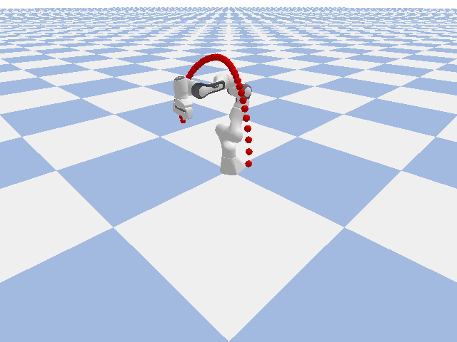

# GuidedPolynomialDiff

Bernstein Coefficients obtained after denoising:-

Final Trajectories after Reconstruction:-

As we can see we can smooth trajectories from the diffusion model and reconstruction.  